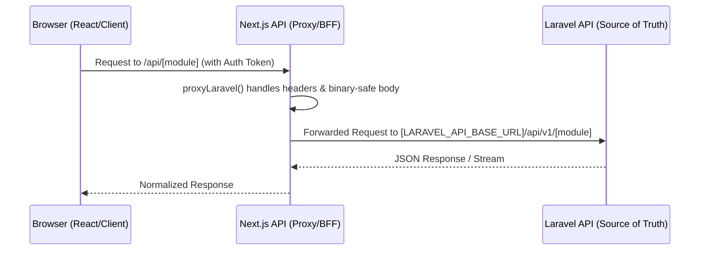

# Frontend-Backend Contract Gap Audit

## 1. Arsitektur Call Flow
Alur komunikasi data pada TCT Hybrid mengikuti pola **BFF (Backend-for-Frontend)** menggunakan Next.js Route Handlers sebagai proxy:

- **Next.js Proxy:** Terletak di `src/lib/proxy-laravel.ts`. Bertugas meneruskan header `Authorization` (Bearer), `Cookie`, dan `Content-Type`.
- **Laravel API:** Menyediakan endpoint RESTful di bawah prefix `/api/v1/`.

## 2. Daftar Endpoint Utama (Status: CLEAN)
Endpoint berikut telah terverifikasi memiliki integrasi yang stabil dan kontrak yang dipahami dengan baik antara frontend dan backend.

| Domain | Next.js API Path | Laravel API Path | Status Kontrak |
|---|---|---|---|
| **Auth** | `/api/auth/login` | `/api/v1/login` | ✅ Clean |
| **Profile** | `/api/profile` | `/api/v1/profile` | ✅ Clean (Patched) |
| **Today** | `/api/today` | `/api/v1/today` | ⚠️ Available (Heavy Fallback) |
| **Community** | `/api/community/posts` | `/api/v1/community/posts` | ✅ Clean (Legacy Parity) |
| **Versehub** | `/api/versehub/*` | `/api/v1/versehub/*` | ✅ Clean |
| **Study Paths**| `/api/study-paths/*` | `/api/v1/study-paths/*` | ✅ Clean |

## 3. Mismatch & Risk per Domain

### A. Domain Today (High Risk)
- **Problem:** Struktur data `Today` seringkali mengembalikan array kosong atau null pada beberapa key (missal: `verse`, `rituals`), yang memicu `.tct-fallback` di frontend.
- **Risk:** User melihat tampilan "Mode Tenang" (fallback) secara terus-menerus meskipun data di database admin sebenarnya sudah diisi, akibat ketidakcocokan identifikasi index harian.

### B. Domain Community (Medium Risk)
- **Problem:** Terdapat dualitas field antara `camelCase` (frontend type) dan `snake_case` (backend/legacy). 
- **Contoh:** `author.avatarUrl` vs `author.avatar_url`. 
- **Risk:** Jika mapper di `CommunityService.ts` tidak lengkap, avatar atau status *official* member mungkin tidak muncul (Fallback `mapApiPost` sudah mencoba menangani ini).

### C. Domain Profile (Solved Risk)
- **Problem:** Resolusi URL Avatar untuk path relatif (`/storage/...`).
- **Status:** Sudah diperbaiki via `resolveSafeAvatarUrl`, namun tetap berisiko jika konfigurasi `APP_URL` di Laravel tidak sinkron dengan `NEXT_PUBLIC_API_BASE_URL`.

## 4. Area Inline Type (Technical Debt)
Terdapat beberapa area di mana tipe data didefinisikan secara lokal (*inline*) di dalam service, bukan di file `.d.ts` atau `types.ts` bersama:

- **`src/services/community.service.ts`:** Mendefinisikan `interface ApiPost` secara internal (Baris 25-57).
- **`src/app/profile/page.tsx`:** Memiliki interface lokal untuk payload profile.
- **`src/app/today/components/...`:** Beberapa tipe data seksi hari ini tersebar di komponen individual.

## 5. Area yang Perlu Schema Contract Bersama
Codex disarankan membuat repositori tipe data atau file `contract.types.ts` untuk area berikut:
1. **`ApiResponseEnvelope<T>`**: Standarisasi pembungkus `{ data: T, message?: string }`.
2. **`GlobalProfile`**: Memastikan field `avatar_url`, `is_admin`, dan `preferences` memiliki nama field yang sama di kedua sisi.
3. **`CommunityModels`**: Menyatukan skema Post, Comment, dan Author.

## 6. Rekomendasi Prioritas untuk Codex
1. **Refactor Community Types:** Pindahkan `interface ApiPost` dari `community.service.ts` ke `@/features/community/types.ts` dan gunakan untuk validasi Zod jika memungkinkan.
2. **Standardize API Proxy Handlers:** Pastikan semua Route Handler di `src/app/api/` konsisten menggunakan `proxyLaravel`.
3. **Fix Today Data Reliability:** Masuk ke Controller Laravel untuk memastikan `/api/v1/today` selalu mengirimkan objek minimal (tidak null) agar tidak memicu fallback frontend secara prematur.
4. **Clean up Local Interfaces:** Audit `src/app/profile/page.tsx` dan ekstrak interface data ke file terpisah.

---
**Status Akhir Audit:** ⚠️ **75% SYNCHRONIZED**
Integrasi sudah "tembus" secara fungsional, namun kerapuhan kontrak (mismatch field & inline types) masih menjadi sumber bug UI minor seperti avatar hilang atau teks pudar.
