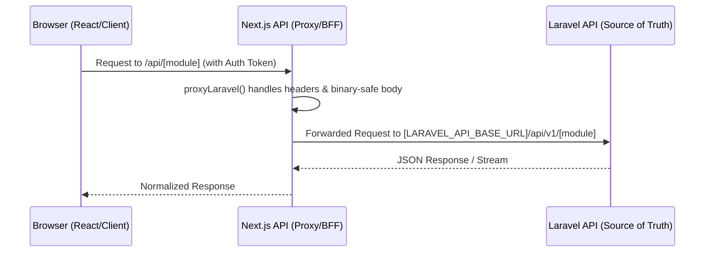

# Frontend-Backend Contract Gap Audit

## 1. Arsitektur Call Flow (BFF Pattern)
Alur komunikasi data pada TCT Hybrid mengikuti pola **BFF (Backend-for-Frontend)** menggunakan Next.js Route Handlers sebagai proxy:

- **Next.js Proxy:** Terletak di `src/lib/proxy-laravel.ts`. Bertugas meneruskan header `Authorization` (Bearer), `Cookie`, dan `Content-Type`.
- **Laravel API:** Menyediakan endpoint RESTful di bawah prefix `/api/v1/`.

## 2. Status Kontrak Utama (Verified Status)

| Domain | Next.js API Path | Laravel API Path | Status Kontrak | Bukti Source |
|---|---|---|---|---|
| **Auth** | `/api/auth/login` | `/api/v1/login` | ✅ Clean | `backend-api/routes/api.php:26` |
| **Profile** | `/api/profile` | `/api/v1/profile` | ✅ Patched (Avatar) | `src/app/profile/page.tsx:182` |
| **Today** | `/api/today` | `/api/v1/today` | ⚠️ Available (Heavy Fallback) | `src/app/today/page.tsx:140-142` |
| **Community** | `/api/community/posts` | `/api/v1/community/posts` | ✅ Clean (Legacy Parity) | `src/features/community/pages/CommunityPage.tsx` |
| **Versehub** | `/api/versehub/*` | `/api/v1/versehub/*` | ✅ Clean | `src/app/versehub/[lang]/chapter/[ref]/page.tsx` |
| **Study Paths**| `/api/study-paths/*` | `/api/v1/study-paths/*` | ✅ Clean | `src/app/versehub/[lang]/study-paths/[slug]/page.tsx` |

## 3. High-Priority Mismatch (Contract Gaps)

### A. Today API Contract Mismatch
- **Issue:** Frontend mengharapkan `pinnedLesson` dan `welcomeVerse` (`src/app/today/page.tsx:140-142`).
- **Reality:** Backend Controller (`backend-api/app/Http/Controllers/Api/V1/TodayApiController.php:24-30`) tidak menyertakan kedua field tersebut dalam payload respons.
- **Risk:** Pengguna melihat state "fallback/mock" untuk lesson dan verse harian meskipun data sebenarnya tersedia di database.

### B. Journey CTA Not End-to-End
- **Issue:** `src/app/profile/page.tsx:661` menggunakan `router.push('/profile?section=journey')`.
- **Reality:** Halaman `ProfilePage` tidak membaca param `section` (`useSearchParams` tidak diimpor/dipakai di `src/app/profile/page.tsx`). Hal ini menyebabkan tombol Growth Monitoring tidak berfungsi sebagaimana mestinya.

### C. Backend Ready, Frontend Sync Lag (Reflections & Journey)
- **Reflections:** Backend API tersedia (`backend-api/routes/api.php:84-86`), namun frontend tetap menggunakan data statis/mock (`src/app/versehub/[lang]/reflections/page.tsx:28-30`, `src/app/reflections/[slug]/page.tsx:22`).
- **Journey:** Summary API aktif digunakan di Profile (`src/app/profile/page.tsx:225`), namun halaman detail perjalanan rohani tetap mock (`src/app/versehub/[lang]/my-spiritual-journey/page.tsx:180-183`).

## 4. Security Blocker: Proxy Token Logging
- **Critical Risk:** `src/lib/proxy-laravel.ts:30` mengandung `console.log("PROXY_DEBUG_TOKEN:", JSON.stringify(authorization));`.
- **Impact:** Mengekspos `Authorization/Bearer` token user secara langsung ke server environment logs. **Wajib dihapus segera sebelum rilis berikutnya.**

## 5. Technical Debt (Inline Types & Dead Code)
- **Inline Interfaces:** `src/app/profile/page.tsx:41` dan `src/services/community.service.ts:25-57` masih menggunakan interface lokal alih-alih tipe data terpusat.
- **Dead Code:** `src/components/core/GreetingHeader.tsx` tidak digunakan aktif di source code runtime manapun (digantikan oleh versi lokal di today module).
- **Mock Cleanup:** `src/features/community/mock.ts` tidak memiliki import aktif dan dapat dihapus.

## Rekomendasi Prioritas (Action Plan)
1. **Security Patch:** Hapus baris logging token di `proxy-laravel.ts:30`.
2. **Standardize Today Response:** Update backend untuk menyertakan `pinnedLesson` dan `welcomeVerse`.
3. **Fix Journey CTA:** Tambahkan `useSearchParams` di `ProfilePage` untuk navigasi section journey.
4. **Wiring Reflections & Journey:** Hubungkan frontend yang masih mock ke API backend yang sudah tersedia.

