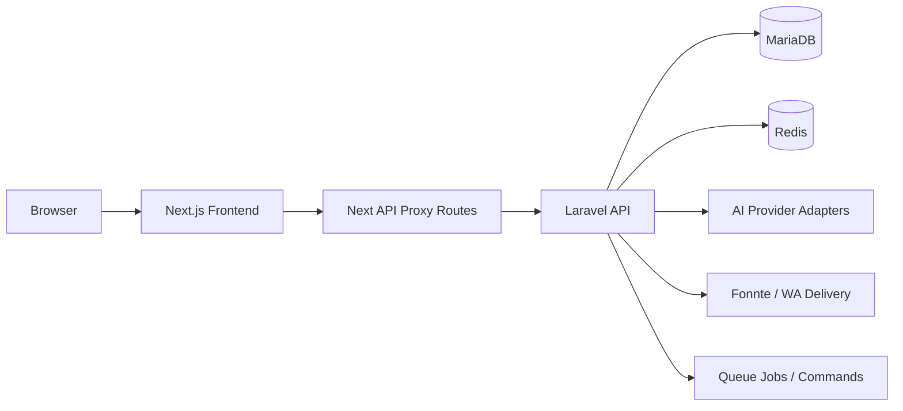

# Architecture Proof (Step 3 Focus 6)

## Scope
Architecture proof ties design claims to actual repository evidence and current runtime status.

## Frontend Architecture
- Evidence:
  - `src/app/**`
  - `src/features/**`
  - `src/lib/**`
- Runtime status: Partial runtime verified.
- Proof status: Route-level and component-level evidence strong; some runtime checks impacted by local Docker/dev compile bottlenecks.
- Limitations: Manual route proof reproducibility can vary by local runtime state.

## Backend Architecture
- Evidence:
  - `backend-api/app/**`
  - `backend-api/routes/api.php`
  - `backend-api/routes/console.php`
- Runtime status: Verified for core auth/profile APIs and tested modules.
- Proof status: Strong test evidence + direct API execution.
- Limitations: Provider-dependent integrations depend on env and external service availability.

## API Proxy Architecture (Next -> Laravel)
- Evidence:
  - `src/lib/proxy-laravel.ts`
  - `src/lib/laravel-api.ts`
  - `src/app/api/**`
- Runtime status: Container-level backend reachability verified.
- Proof status: Partial host-path runtime proof due intermittent frontend runtime bottlenecks.
- Limitations: Local startup/build slowness can create false negatives.

## AI Provider Abstraction
- Evidence:
  - `backend-api/app/Services/AI/AIProviderInterface.php`
  - `backend-api/app/Services/AI/OpenAIResponsesClient.php`
  - `backend-api/app/Providers/AppServiceProvider.php`
- Runtime status: Code/test-verified abstraction, runtime provider success env-dependent.
- Proof status: Verified architecture + tested supporting flows.
- Limitations: Do not claim provider-level production uptime without runtime evidence.

## Onboarding Pipeline Architecture
- Evidence:
  - `backend-api/app/Services/Onboarding/OnboardingPipelineService.php`
  - `backend-api/app/Jobs/Onboarding/ProcessOnboardingLeadJob.php`
  - `src/app/aios/page.tsx`
- Runtime status: Runtime verified MVP.
- Proof status: Supported by runtime proof test and route evidence.
- Limitations: CRM/calendar still adapter-ready unless webhook config + runtime proof complete.

## WhatsApp Verification Flow
- Evidence:
  - `backend-api/app/Http/Controllers/Api/V1/UserWhatsappVerificationController.php`
  - `backend-api/app/Models/UserWhatsappVerification.php`
  - `backend-api/config/whatsapp_verification.php`
- Runtime status: API flow verified; provider send result environment-dependent.
- Proof status: Strong backend test coverage.
- Limitations: Real provider delivery cannot be assumed in every environment.

## Notification Preference Flow
- Evidence:
  - `UserNotificationPreferenceController.php`
  - `UserNotificationPreference` model + migration
  - `src/app/profile/page.tsx` consumption paths
- Runtime status: Verified API + integrated UX path.
- Proof status: Feature tests present.
- Limitations: Requires authenticated session and stable frontend runtime for manual UX proof.

## Queue/Job Architecture
- Evidence:
  - `backend-api/app/Jobs/**`
  - `backend-api/routes/console.php`
- Runtime status: Configured and partially runtime verified depending service mode.
- Proof status: Code-level and command-level evidence.
- Limitations: Full production queue behavior depends on deployment infra.

## Telemetry/Logging Architecture
- Evidence:
  - `backend-api/app/Services/AI/AITelemetryService.php`
  - `ai_activity_logs` migration/model
- Runtime status: Optional persistence available.
- Proof status: Code-level verified.
- Limitations: Persist mode may be off by config.

## Docker/Runtime Architecture
- Evidence:
  - `docker-compose.yml`
  - `docker/backend/start.sh`
  - `docker/frontend/start.sh`
- Runtime status: Containers run locally; frontend runtime stability varies by mode/build state.
- Proof status: Partial runtime verified.
- Limitations: Local build/compile bottlenecks can impact manual checks.

## Observability/DevOps Architecture
- Evidence:
  - `docker/observability/**`
  - `.github/workflows/**`
- Runtime status: Configured; runtime verification varies per environment/session.
- Proof status: Config-level verified.
- Limitations: Do not claim active production observability without live proof.

## Related Docs / Tests / Routes / Evidence
- Docs: [Feature Matrix](./feature-matrix.md), [Runtime Environment](./runtime-environment.md), [Evidence Integrity Rules](./evidence-integrity-rules.md)
- Tests: [Proof Checklist](./proof-checklist.md)
- Evidence: [Evidence Map](./evidence-map.md), [Runtime Proof Checklist](./runtime-proof-checklist.md)
