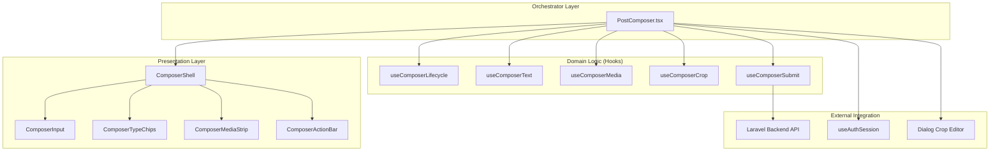
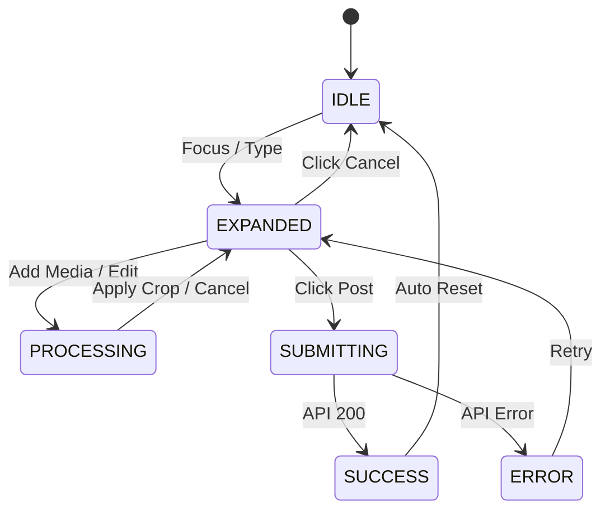
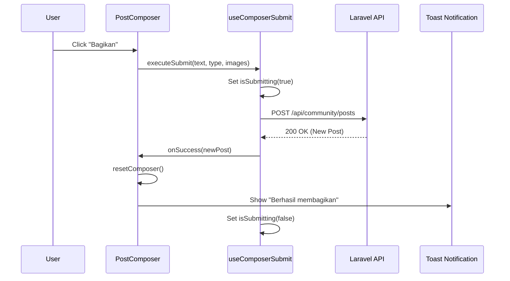

# Composer System Diagrams

**Scope**: Visualizing PostComposer Modular Architecture

---

## 1. System Module Diagram
Menunjukkan hubungan antara Orchestrator, Hooks Domain, dan UI Components.

---

## 2. Lifecycle & State Diagram
Menunjukkan transisi status dari kondisi draf hingga pengiriman.

---

## 3. Data Flow Diagram: Submission Flow
Aliran data saat pengguna memicu aksi "Bagikan".

---

*Diagrams authored by Antigravity Principal Architect*
