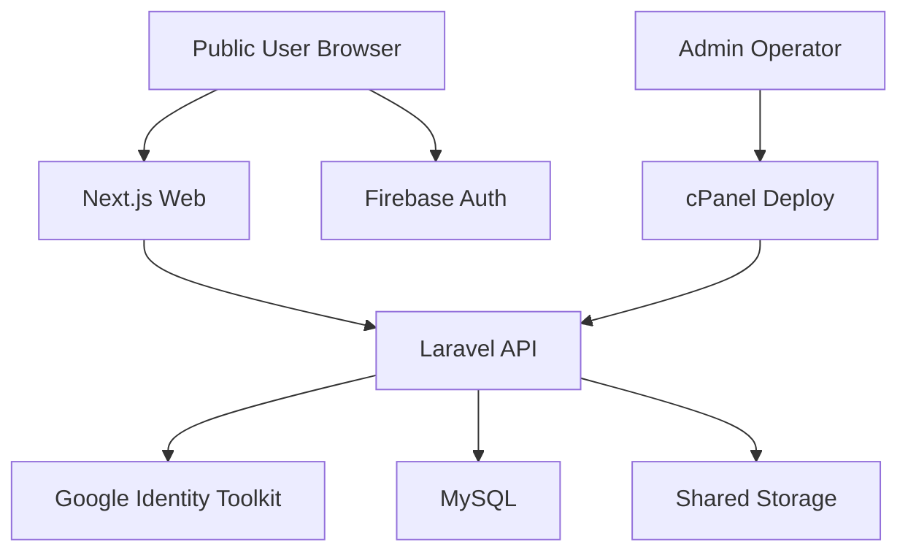

## Executive summary

Risiko tertinggi repo ini berada pada boundary autentikasi hybrid dan data sensitif high-trust: browser publik menyimpan token bearer Sanctum di `localStorage`, frontend Next.js mem-proxy request ke Laravel API, backend juga menerima sinkronisasi identitas dari Firebase, dan aplikasi memegang data sensitif tingkat tinggi seperti private message, reflection/journal, profile email, serta admin ops data. Tema risiko teratas adalah pencurian token/session melalui XSS atau auth-state confusion, penyalahgunaan surface write yang belum terlihat memiliki rate limit eksplisit, dan kompromi boundary operator/deploy yang dapat mengubah runtime backend cPanel secara langsung.

## Scope and assumptions

- In-scope paths:
  - `src/**`
  - `backend-api/**`
  - `docs/CORE/architecture/**`
- Out of scope:
  - Tencent dashboard internal
  - cPanel account hardening di luar repo
  - MySQL server OS/network hardening di luar repo
  - third-party provider internals (Firebase, Google Identity Toolkit, Tencent Edge, Cloudflare)
- Assumptions validated:
  - aplikasi bersifat `single-tenant` untuk satu organisasi
  - data `private messages + reflection/journal + profile email + admin ops data` diperlakukan sebagai sensitivitas tinggi
  - frontend production ada di Tencent dan backend production ada di cPanel
  - backend deploy bersifat manual via operator dan script deploy
- Open questions that would materially change risk ranking:
  - apakah ada WAF/rate-limit tambahan di edge yang menahan abuse request write-heavy
  - apakah admin/ops users dipisahkan perangkat/browser dari akun member biasa

## System model

### Primary components

- Next.js web app di root repo menangani UI publik, route handlers, dan proxy ke backend Laravel.
  - Evidence anchors:
    - [package.json](../../../package.json)
    - [src/lib/proxy-laravel.ts](../../../src/lib/proxy-laravel.ts)
- Laravel API di `backend-api/` menangani auth, profile, community, today, versehub, study paths, serta admin/Filament.
  - Evidence anchors:
    - [backend-api/routes/api.php](../../../backend-api/routes/api.php)
    - [backend-api/routes/web.php](../../../backend-api/routes/web.php)
- Firebase dipakai pada frontend untuk auth state dan pada backend untuk sinkronisasi identitas melalui Google Identity Toolkit.
  - Evidence anchors:
    - [src/components/FirebaseAuthSync.tsx](../../../src/components/FirebaseAuthSync.tsx)
    - [backend-api/app/Http/Controllers/Api/V1/FirebaseAuthSyncController.php](../../../backend-api/app/Http/Controllers/Api/V1/FirebaseAuthSyncController.php)
- MySQL/MariaDB adalah data store utama untuk user, member posts, study paths, versehub actions, direct messages, reflection responses, dan admin logs.
  - Evidence anchors:
    - [backend-api/database/migrations](../../../backend-api/database/migrations)
    - [MYSQL SCHEMA PARITY AUDIT 2026-03-23.md](./MYSQL%20SCHEMA%20PARITY%20AUDIT%202026-03-23.md)
- Shared filesystem cPanel dipakai untuk avatar dan media community dengan penyajian melalui route avatar API dan `/storage/...`.
  - Evidence anchors:
    - [backend-api/app/Models/User.php](../../../backend-api/app/Models/User.php)
    - [backend-api/app/Http/Controllers/ProfileController.php](../../../backend-api/app/Http/Controllers/ProfileController.php)
    - [backend-api/app/Http/Controllers/Api/V1/CommunityApiController.php](../../../backend-api/app/Http/Controllers/Api/V1/CommunityApiController.php)
- Operator deploy backend melalui `backend-api/deploy.sh` ke release path cPanel.
  - Evidence anchor:
    - [backend-api/deploy.sh](../../../backend-api/deploy.sh)

### Data flows and trust boundaries

- Browser User -> Tencent Next.js
  - Data: credentials, signup data, profile edits, posts, comments, reflections, journal, private message actions
  - Channel: HTTPS
  - Security guarantees: TLS, React escaping by default, app shell auth status logic
  - Validation: frontend input checks only; trust boundary utama tetap di backend

- Browser User -> Firebase Auth
  - Data: Firebase credentials / ID token
  - Channel: HTTPS
  - Security guarantees: provider-managed auth
  - Validation: frontend hanya menerima auth state / token, backend tidak langsung mempercayai browser tanpa revalidation

- Browser/Tencent Next.js route handlers -> Laravel API
  - Data: Authorization bearer token, cookies, X-XSRF-TOKEN, JSON payloads, uploads
  - Channel: server-side fetch over HTTPS
  - Security guarantees: same-origin web app mem-proxy ke API; headers penting diteruskan
  - Validation: backend Laravel validation dan middleware
  - Evidence anchors:
    - [src/lib/proxy-laravel.ts](../../../src/lib/proxy-laravel.ts)
    - [src/lib/laravel-api.ts](../../../src/lib/laravel-api.ts)

- Laravel API -> Google Identity Toolkit
  - Data: Firebase ID token
  - Channel: outbound HTTPS
  - Security guarantees: backend-side verification via Google endpoint
  - Validation: payload lookup dan checks presence `localId`
  - Evidence anchor:
    - [backend-api/app/Http/Controllers/Api/V1/FirebaseAuthSyncController.php](../../../backend-api/app/Http/Controllers/Api/V1/FirebaseAuthSyncController.php)

- Laravel API -> MySQL
  - Data: high-sensitivity user/profile/message/reflection/admin state
  - Channel: DB driver
  - Security guarantees: framework ORM/migrations; app-level authz
  - Validation: request validation and model/DB constraints

- Laravel API -> Public/Shared Storage
  - Data: avatars and community media
  - Channel: filesystem
  - Security guarantees: stored under `storage/app/public`; avatar route checks file exists
  - Validation: file/image validation on upload, but media remains internet-reachable once public

- Operator -> cPanel deploy script
  - Data: Git source, `.env`, release symlink, Composer install, cache builds
  - Channel: SSH + local filesystem
  - Security guarantees: SSH key access, atomic symlink switch, backup release history
  - Validation: healthcheck and optional migration step, but `RUN_MIGRATIONS=false` by default

#### Diagram

## Assets and security objectives

| Asset | Why it matters | Security objective (C/I/A) |
|---|---|---|
| Sanctum bearer tokens | Member/session takeover gives write access across profile, community, study, inbox | C/I |
| Firebase ID tokens | Bridge identity into local user model | C/I |
| Private messages | High-sensitivity interpersonal content | C/I |
| Reflection / journal drafts / responses | Spiritual/private content with strong privacy expectation | C/I |
| User profile data | Email, avatar, 2FA state, role signals | C/I |
| Admin ops data / audit summaries | Could expose operational posture and moderation workflow | C/I |
| Community content and media | Public trust, abuse prevention, moderation integrity | I/A |
| Study/Today/VerseHub content | Core product integrity and availability | I/A |
| MySQL schema and data | Central state for all user and content flows | C/I/A |
| Shared `.env` and deploy keys | Full runtime compromise if exposed | C/I/A |

## Attacker model

### Capabilities

- Remote internet attacker with public access to `www` and `api`
- Authenticated low-privilege member attacker
- Attacker able to post community content, upload images, send comments, and interact with profile/auth flows
- Attacker able to target browser-based weaknesses such as XSS/token theft if any rendering/injection bug exists
- Attacker able to abuse missing rate limits or high-cost endpoints
- Operator workstation compromise is considered realistic enough to model for deployment risk because backend deploy is manual and key-based

### Non-capabilities

- No assumed cross-tenant breakout scenario because service is single-tenant
- No assumed direct shell on cPanel or DB unless operator credentials/deploy key are already compromised
- No assumed ability to break Firebase or Google infra itself
- No assumed arbitrary code execution in PHP/Node absent an application flaw

## Entry points and attack surfaces

| Surface | How reached | Trust boundary | Notes | Evidence (repo path / symbol) |
|---|---|---|---|---|
| `/api/v1/login`, `/api/v1/register` | Public web/app auth | Internet -> Laravel API | Issues bearer token `next-web` | [backend-api/routes/api.php](../../../backend-api/routes/api.php), [AuthController@login/register](../../../backend-api/app/Http/Controllers/Api/V1/AuthController.php) |
| `/api/v1/auth/firebase/sync` | Frontend Firebase flow | Browser/Next -> Laravel -> Google | Creates/updates user and issues Sanctum token | [FirebaseAuthSyncController::sync](../../../backend-api/app/Http/Controllers/Api/V1/FirebaseAuthSyncController.php) |
| `/api/v1/profile` and 2FA endpoints | Authenticated member/admin | Authenticated client -> Laravel API | Exposes high-sensitivity profile and 2FA management | [backend-api/routes/api.php](../../../backend-api/routes/api.php), [ProfileController](../../../backend-api/app/Http/Controllers/ProfileController.php) |
| `/api/v1/community/posts` write path | Authenticated member | Authenticated client -> Laravel API -> Storage/DB | Supports multi-image upload up to 5 files | [CommunityApiController::store](../../../backend-api/app/Http/Controllers/Api/V1/CommunityApiController.php) |
| `/api/v1/community/posts/{id}/comments` | Authenticated member | Authenticated client -> Laravel API | User-generated text, reply flows, notifications | [CommunityApiController::commentsStore](../../../backend-api/app/Http/Controllers/Api/V1/CommunityApiController.php) |
| `/api/v1/avatar/{user}` | Public | Internet -> Laravel API -> Storage | Serves avatar files with long cache | [ProfileController::avatar](../../../backend-api/app/Http/Controllers/ProfileController.php) |
| `/storage/...` media serving | Public | Internet -> Laravel/storage layer | Community image exposure path | [CommunityApiController::syncPublicMediaMirror](../../../backend-api/app/Http/Controllers/Api/V1/CommunityApiController.php), [filesystems.php](../../../backend-api/config/filesystems.php) |
| Next.js route handlers `/src/app/api/**` | Browser -> Next.js -> Laravel | Browser -> Tencent Next -> Laravel | Proxy forwards cookie/auth/xsrf | [src/lib/proxy-laravel.ts](../../../src/lib/proxy-laravel.ts) |
| Manual backend deploy | Operator SSH | Operator -> cPanel filesystem/runtime | Sparse checkout and atomic release | [backend-api/deploy.sh](../../../backend-api/deploy.sh) |

## Top abuse paths

1. Attacker finds or induces an XSS in any rendered web surface -> steals Sanctum bearer token from `localStorage` -> replays token against authenticated API endpoints -> reads/modifies profile, inbox, community actions, and user state.
2. Attacker abuses auth-state confusion between Firebase user state and local bearer token state -> stale/forged client state causes frontend to treat user as authenticated -> protected action attempts succeed where backend checks are weak or leak behavior.
3. Attacker compromises or misconfigures Firebase project linkage -> submits valid-looking Firebase ID token through `/api/v1/auth/firebase/sync` -> backend links or creates local user and issues application token.
4. Attacker uploads abusive or excessive media to community composer repeatedly -> consumes storage, CPU, or moderation capacity -> degrades service availability and content integrity.
5. Attacker targets profile or 2FA flows with stolen current session/token -> disables protections, rotates recovery codes, or updates profile metadata -> deepens account persistence.
6. Attacker abuses public media delivery paths or avatar endpoints -> enumerates predictable user/media references -> collects sensitive metadata or amplifies scraping of member identity.
7. Attacker with operator key or deploy-host access modifies shared `.env` or deploy source -> ships malicious backend release -> full compromise of API, data, and admin flows.

## Threat model table

| Threat ID | Threat source | Prerequisites | Threat action | Impact | Impacted assets | Existing controls (evidence) | Gaps | Recommended mitigations | Detection ideas | Likelihood | Impact severity | Priority |
|---|---|---|---|---|---|---|---|---|---|---|---|---|
| TM-001 | Remote attacker / malicious content author | Attacker finds a script injection or unsafe rendering path in any web surface | Steal Sanctum bearer token from `localStorage` and replay authenticated API requests | Account takeover and sensitive data access | Sanctum tokens, profile data, private messages, journals | Security headers and CSP exist at app layer; token format validation removes malformed tokens ([SecurityHeaders](../../../backend-api/app/Http/Middleware/SecurityHeaders.php), [app-auth-token.ts](../../../src/services/app-auth-token.ts)) | Tokens are stored in `localStorage`, which is readable by XSS; CSP still allows `unsafe-inline` and admin allows `unsafe-eval` | Reduce XSS surface, move toward httpOnly/session-backed auth where possible, tighten CSP, audit rich text/rendering surfaces, monitor token issuance/use anomalies | Alert on unusual token churn, profile/2FA changes, suspicious cross-IP token reuse | medium | high | high |
| TM-002 | Authenticated member attacker / remote attacker with stale browser state | User has Firebase state and/or leftover bearer token | Exploit hybrid auth-state confusion so frontend or proxy treats stale token presence as authenticated | Incorrect guest/member gating, unwanted writes, privacy confusion | Auth state integrity, protected write actions | `useAuthSession` distinguishes `restoring/guest/authenticated`; invalid token formats are scrubbed ([use-auth-session.ts](../../../src/auth/use-auth-session.ts), [app-auth-token.ts](../../../src/services/app-auth-token.ts)) | Auth model still has two sources of truth: Firebase and bearer token; no central server-validated session introspection on every route | Add explicit token verification / ping gate for protected app shell flows, unify source-of-truth for auth status, add integration tests for refresh/reopen flows | Log 401/403 bursts after UI-authenticated actions, track auth-sync failures and token mismatch patterns | medium | medium | medium |
| TM-003 | Remote attacker with control of Firebase account context or compromised client project linkage | Valid Firebase ID token from same project or misbound project config | Call `/api/v1/auth/firebase/sync` to create/link local user and mint app token | Unauthorized local account linkage and access token issuance | Local user accounts, bearer tokens, profile integrity | Backend validates ID token via Google lookup and requires `localId`; duplicate email handling exists ([FirebaseAuthSyncController::sync](../../../backend-api/app/Http/Controllers/Api/V1/FirebaseAuthSyncController.php)) | Security depends heavily on correct Firebase project/API key alignment; no explicit issuer/audience claim verification code in repo | Add explicit project/issuer checks against decoded token metadata or Admin SDK verification, alert on new Firebase-linked account creation, review fallback generated emails | Monitor sync volume, new account creation from Firebase flow, duplicate email/uid collisions | medium | high | high |
| TM-004 | Authenticated member attacker | Valid account and repeated write access | Abuse community image upload and text posting to consume storage/moderation bandwidth or host abusive content | Availability degradation, storage growth, moderation burden | Storage, community integrity, operator workload | File validation limits types/count/size ([CommunityApiController::store](../../../backend-api/app/Http/Controllers/Api/V1/CommunityApiController.php)) | No explicit repo-evidenced rate limiting or quota controls on post/comment/upload routes | Add route throttles, per-user quotas, abuse scoring, moderation queue, content scanning where feasible | Monitor upload frequency, file volume, sudden storage spikes, post creation bursts | high | medium | high |
| TM-005 | Attacker with stolen token/session | Access to valid bearer token or active device | Use profile and 2FA endpoints to change password/2FA state or regenerate recovery codes | Persistent account compromise | Profile identity, 2FA state, recovery codes | Current password required for sensitive profile actions; 2FA flows validate code/recovery code ([ProfileController](../../../backend-api/app/Http/Controllers/ProfileController.php)) | If current session is stolen on an already-authenticated device, high-value endpoints remain reachable; no evidence of step-up auth beyond password/code | Add step-up auth / recent-auth window for 2FA disable and password changes, alert on 2FA state changes, revoke other tokens after critical profile changes | Alert on 2FA setup/disable/recovery regeneration, password updates, token churn after profile changes | medium | high | high |
| TM-006 | Remote scraper / authenticated low-privilege user | Knowledge of predictable user IDs or public media URLs | Enumerate avatar/media endpoints to scrape identity-linked media and member activity artifacts | Privacy erosion and scraping of user identity | Avatar URLs, public media, member identity linkage | Avatar route checks file existence and serves specific file only; public storage path is intentional ([User::getFilamentAvatarUrl](../../../backend-api/app/Models/User.php), [ProfileController::avatar](../../../backend-api/app/Http/Controllers/ProfileController.php)) | Public asset model still allows scraping; predictable IDs and stable URLs aid collection | Add optional signed URLs for sensitive media, avatar access policy review, anti-scrape rate limits/caching rules, user privacy controls | Monitor high-volume avatar/media GET patterns and sequential user ID access | medium | medium | medium |
| TM-007 | Operator workstation attacker / compromised deploy key holder | Access to SSH key or Git source path for deploy | Modify shared `.env` or deploy malicious backend release through manual cPanel deploy flow | Full backend compromise and persistent malicious runtime | `.env`, deploy key, API integrity, DB integrity | Atomic release switching and release history reduce accidental downtime ([backend-api/deploy.sh](../../../backend-api/deploy.sh)) | Manual deploy path is powerful; no commit signature verification or mandatory migration gate; shared `.env` is a single high-value asset | Restrict operator key scope, rotate keys, require out-of-band review for deploys, consider signed release verification, tighten server-side audit logging | Audit deploy logs, monitor unexpected release timestamps/commit SHAs, alert on `.env` changes | low | high | high |

## Criticality calibration

- `critical`
  - Full backend/runtime compromise through deploy key or shared `.env`
  - Pre-auth flaw that exposes private messages, reflections, or admin ops data at scale
  - Direct bypass of authenticated boundaries for profile/inbox/community write actions
- `high`
  - Token theft enabling member account takeover
  - Firebase sync abuse that mints local tokens for the wrong identity
  - 2FA/profile takeover using stolen authenticated context
- `medium`
  - Public media/avatar scraping
  - Abuse-driven storage or moderation exhaustion
  - Auth-state confusion causing inconsistent protected action behavior
- `low`
  - Low-sensitivity info leaks from non-protected UI metadata
  - Dev-only bypass paths that are unreachable in production assumptions

Examples tailored to this repo:
- High: stealing `next-web` token from browser state and calling `/api/v1/profile` or `/api/v1/community/posts`
- High: misbound Firebase sync creating a real local account with high-sensitivity data access
- Medium: repeated multi-image post abuse filling shared storage
- Low: reading publicly intended verse/today content without altering integrity

## Focus paths for security review

| Path | Why it matters | Related Threat IDs |
|---|---|---|
| [src/lib/proxy-laravel.ts](../../../src/lib/proxy-laravel.ts) | Core trust boundary between public web and Laravel API; forwards auth/cookie/XSRF | TM-001, TM-002 |
| [src/services/app-auth-token.ts](../../../src/services/app-auth-token.ts) | Token persistence in `localStorage` is central to takeover risk | TM-001, TM-002 |
| [src/auth/use-auth-session.ts](../../../src/auth/use-auth-session.ts) | Dual-source auth state logic can create confusion or false authenticated state | TM-002 |
| [backend-api/app/Http/Controllers/Api/V1/FirebaseAuthSyncController.php](../../../backend-api/app/Http/Controllers/Api/V1/FirebaseAuthSyncController.php) | Identity bridge and token minting path | TM-003 |
| [backend-api/app/Http/Controllers/Api/V1/AuthController.php](../../../backend-api/app/Http/Controllers/Api/V1/AuthController.php) | Password auth issuance and 2FA gate | TM-001, TM-005 |
| [backend-api/app/Http/Controllers/ProfileController.php](../../../backend-api/app/Http/Controllers/ProfileController.php) | High-sensitivity profile, avatar, and 2FA actions | TM-005, TM-006 |
| [backend-api/app/Http/Controllers/Api/V1/CommunityApiController.php](../../../backend-api/app/Http/Controllers/Api/V1/CommunityApiController.php) | Authenticated write surface with uploads and public media paths | TM-004, TM-006 |
| [backend-api/config/sanctum.php](../../../backend-api/config/sanctum.php) | Governs stateful domain boundary and auth posture | TM-002, TM-005 |
| [backend-api/config/session.php](../../../backend-api/config/session.php) | Session cookie domain/secure settings affect cross-subdomain trust | TM-002, TM-005 |
| [backend-api/deploy.sh](../../../backend-api/deploy.sh) | Manual release path and shared `.env` boundary are operator-critical | TM-007 |

## Notes on use

- Threat model ini berdiri di atas parity baseline yang kini lebih stabil:
  - [MONOREPO HYBRID LOCAL-SERVER PARITY AUDIT.md](./MONOREPO%20HYBRID%20LOCAL-SERVER%20PARITY%20AUDIT.md)
  - [MYSQL SCHEMA PARITY AUDIT 2026-03-23.md](./MYSQL%20SCHEMA%20PARITY%20AUDIT%202026-03-23.md)
- Model ini sengaja memisahkan:
  - runtime/application threats
  - operator/deploy threats
  - schema/data sensitivity concerns
- Quality check:
  - entry points utama tercakup
  - boundary `browser -> next -> api -> db/storage` tercakup
  - runtime vs deploy/manual operator dipisahkan
  - asumsi single-tenant dan high-sensitivity sudah divalidasi
  - open questions eksplisit dan terbatas
